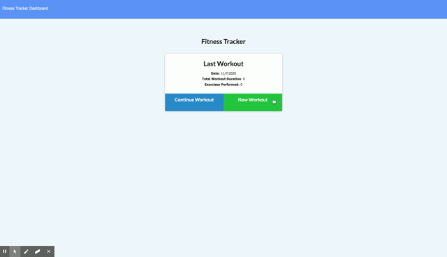

# Workout Tracker

Easily Track your workouts!

## Description

This app helps you to organize your workouts. You can enter in different types of workouts and the details for each workout. You can also look at the statistics of your workouts so you can track your progress.

## Table of Contents

- [Installation](#installation)
- [Usage](#usage)
- [Credits](#credits)
- [License](#license)

## Installation

Click on the deployed link here

## Usage

- You create a new workout.
- You enter if your new workout is cardio or resistance.
- If it's cardio, you enter the name, distance, and duration.
- If it's resistance, you enter the name, weight, sets, reps, and duration.
- You can enter more exercise or finsih by clicking complete.
- You can click on the dashboard to see your statistics.

## Credits

David Anusontarangkul
[Github](https://github.com/anusontarangkul)
[LinkedIn](https://www.linkedin.com/in/anusontarangkul/)

This project was apart of the UC Berkeley Coding Bootcamp.

## License

Copyright <2020> <Anusontarangkul>

Permission is hereby granted, free of charge, to any person obtaining a copy of this software and associated documentation files (the "Software"), to deal in the Software without restriction, including without limitation the rights to use, copy, modify, merge, publish, distribute, sublicense, and/or sell copies of the Software, and to permit persons to whom the Software is furnished to do so, subject to the following conditions:

The above copyright notice and this permission notice shall be included in all copies or substantial portions of the Software.

THE SOFTWARE IS PROVIDED "AS IS", WITHOUT WARRANTY OF ANY KIND, EXPRESS OR IMPLIED, INCLUDING BUT NOT LIMITED TO THE WARRANTIES OF MERCHANTABILITY, FITNESS FOR A PARTICULAR PURPOSE AND NONINFRINGEMENT. IN NO EVENT SHALL THE AUTHORS OR COPYRIGHT HOLDERS BE LIABLE FOR ANY CLAIM, DAMAGES OR OTHER LIABILITY, WHETHER IN AN ACTION OF CONTRACT, TORT OR OTHERWISE, ARISING FROM, OUT OF OR IN CONNECTION WITH THE SOFTWARE OR THE USE OR OTHER DEALINGS IN THE SOFTWARE.
